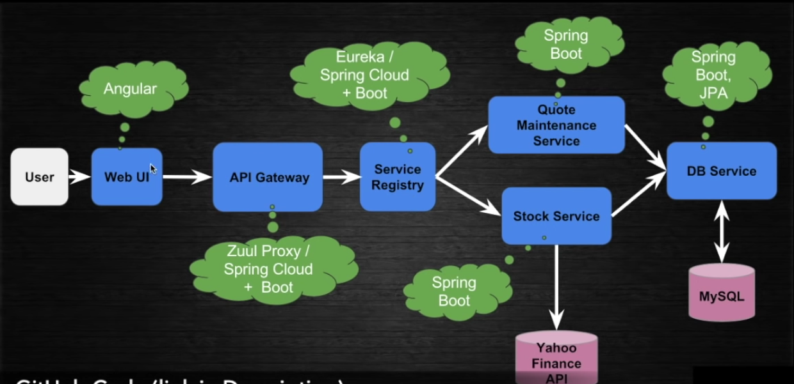

# Java Microservice Projects

I'm using only one repo to make it easier.

Created based on the YouTube videos by TechPrimers.

Designing Microservices using Spring Boot, Spring Cloud, Eureka and Zuul | # 1 | Tech Primers

https://www.youtube.com/watch?v=rlS9eH5tEnY

For more info:
https://github.com/TechPrimers/stock-price-viewer-microservices-part1
https://github.com/TechPrimers/stock-price-viewer-microservices-part2-final

Covering the below microservices:

- `db-service` (port: 8300) - For interactive with MySQL DB
- `stock-service` (port: 8301) - For pulling Stock Price from YahooFinance API
- `eureka-service` (port: 8302) - Service Registry for registering all microservices
- `api-gateway` (port: 8303) - Request routing
- `ui` - Simple Angular App

## Architecture Diagram

## Eureka Monitor

http://localhost:8302/
